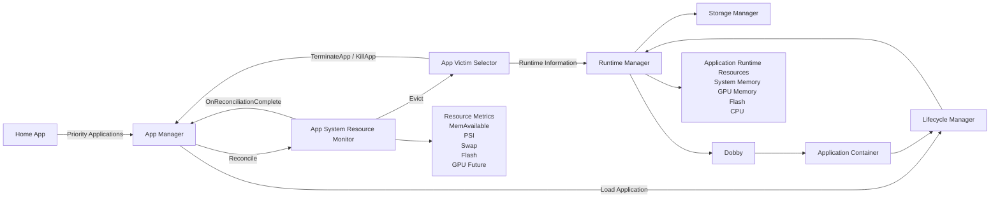
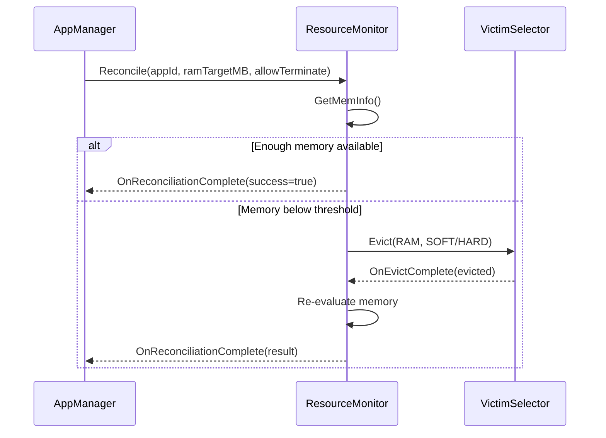
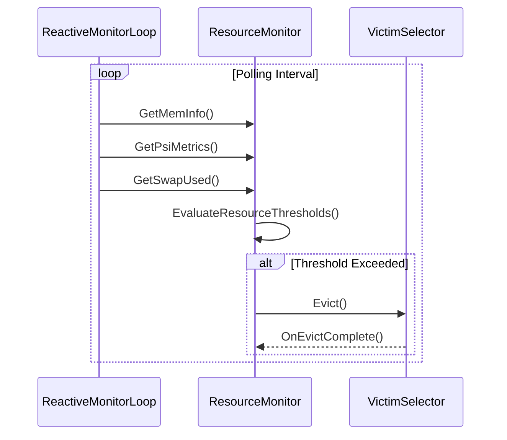
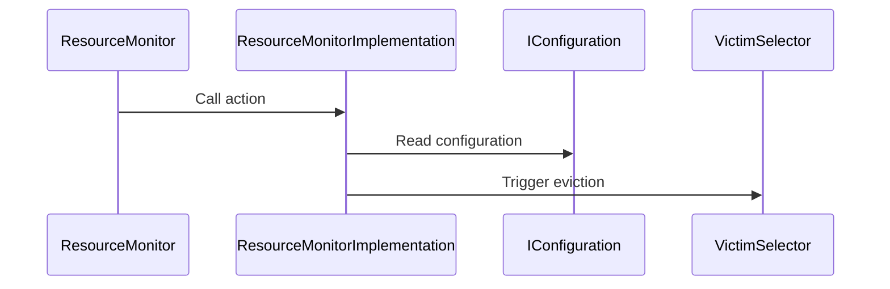
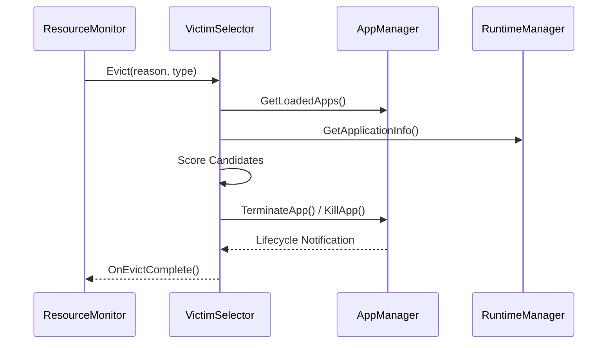
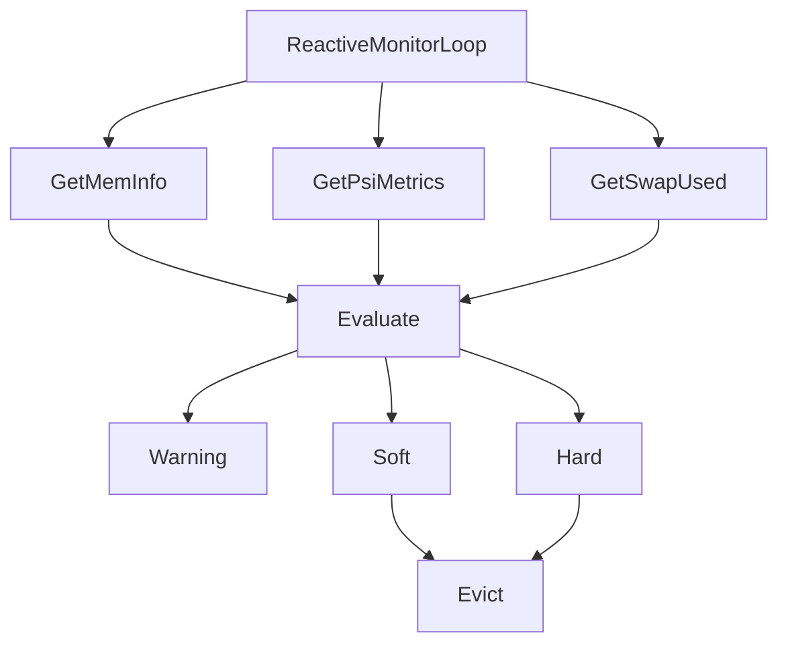
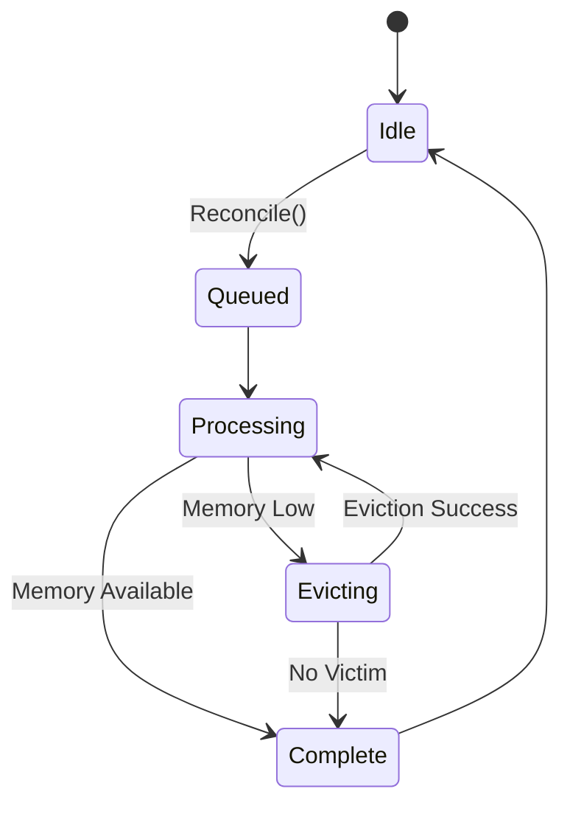

# ResourceMonitor Architecture

# 1. High-Level Purpose & Architecture

## Purpose

ResourceMonitor is responsible for protecting platform stability by continuously monitoring system resource utilization and reclaiming resources before the device enters a degraded or Out-of-Memory (OOM) condition.

The component acts as the resource protection layer within the RDK Application Managers ecosystem and provides both proactive and reactive memory management capabilities.

ResourceMonitor monitors:

- System Memory (MemAvailable)
- Swap Utilization (zram)
- Pressure Stall Information (PSI)
- Flash Storage utilization for hibernated applications

When resource thresholds are exceeded, ResourceMonitor collaborates with VictimSelector to identify and evict inactive applications, allowing the platform to maintain responsiveness and preserve memory headroom.


## Responsibilities

ResourceMonitor is responsible for:

- Monitoring platform memory health
- Monitoring PSI pressure conditions
- Monitoring swap utilization
- Monitoring flash space used by hibernated applications
- Evaluating application launch requests
- Executing resource reconciliation
- Triggering victim selection
- Managing eviction workflows
- Publishing reconciliation completion notifications


## High-Level Architecture

The ResourceMonitor subsystem operates within the RDK Application Managers stack and collaborates with AppManager, VictimSelector, RuntimeManager, LifecycleManager, OCI Containers, and Dobby to protect platform resources.



---

# 2. Architectural Overview
## Proactive Resource Protection

The proactive flow is executed during application launch.

Before a new application becomes active:

1. AppManager invokes `Reconcile()`
2. ResourceMonitor evaluates available memory
3. If enough memory exists:
   - launch proceeds
4. If insufficient memory exists:
   - ResourceMonitor requests eviction through VictimSelector
5. Reconciliation completes after resource availability is re-evaluated

The objective is to maintain sufficient platform headroom before resource exhaustion occurs.


## Reactive Resource Protection

Reactive protection runs continuously in the background through a dedicated monitoring thread.

The monitoring loop periodically evaluates:

- MemAvailable
- Swap utilization
- PSI pressure

Thresholds are divided into:

- Warning
- Soft
- Hard

When limits are crossed:

| Threshold | Action |
|------------|----------|
| Warning | Log warning |
| Soft | Request soft eviction |
| Hard | Request hard eviction |


## Resource Metrics

### MemAvailable

Source:

```text
/proc/meminfo
```

Used to determine:

- Launch eligibility
- Reconciliation success
- Low memory conditions


### PSI

Source:

```text
/proc/pressure/memory
```

Supported metrics:

```text
some_avg10
some_avg60
some_avg300
full_avg10
full_avg60
full_avg300
```

PSI provides early indication of memory pressure before OOM conditions occur.


### Swap

Source:

```text
/sys/block/zram0/mm_stat
```

ResourceMonitor calculates actual swap utilization using:

```text
orig_data_size
```

to determine swap pressure.


### Flash Storage

Source:

```text
/mnt/media/apps/hibernated_apps
```

Flash storage metrics are used to track storage consumed by hibernated applications.


---

# 3. Code Organization (Folder & File-Level)
## Repository Layout

```text
entservices-resourcemonitor
│
├── plugin
│   ├── ResourceMonitor.cpp
│   ├── ResourceMonitor.h
│   ├── ResourceMonitorImplementation.cpp
│   ├── ResourceMonitorImplementation.h
│   ├── ResourceMonitorConfig.cpp
│   ├── ResourceMonitorConfig.h
│   ├── ResourceMonitor.config
│   ├── ResourceMonitor.conf.in
│   ├── ResourceMonitorPlugin.json
│   ├── Module.cpp
│   ├── Module.h
│   └── CMakeLists.txt
│
├── helpers
│   ├── UtilsLogging.h
│   └── UtilsRFCConfig.h
│
├── Tests
│   ├── L1Tests
│   │   └── test_ResourceMonitor.cpp
│   │
│   └── L2Tests
│       └── ResourceMonitor_L2Test.cpp
│
└── ARCHITECTURE.md
```

---

# 4. Class & Interface Documentation
## ResourceMonitor

**Files**

```text
ResourceMonitor.cpp
ResourceMonitor.h
```

### Responsibility

Plugin-facing Thunder component.

Provides:

- Plugin initialization
- JSONRPC registration
- Interface exposure
- Notification forwarding

### Main Duties

```cpp
Initialize()
Deinitialize()
Information()
```

### External Interface

```cpp
Exchange::IResourceMonitor
```


## ResourceMonitorImplementation

**Files**

```text
ResourceMonitorImplementation.cpp
ResourceMonitorImplementation.h
```

### Responsibility

Core implementation owning all monitoring and reconciliation logic.

### Key Responsibilities

- Resource monitoring
- VictimSelector integration
- Reconcile processing
- Threshold evaluation
- Statistics collection
- Notification dispatching


### Monitoring Thread

```cpp
ReactiveMonitorLoop()
EvaluateResourceThresholds()
```

Runs periodically and evaluates:

- MemAvailable
- PSI
- Swap


### Reconciliation Engine

```cpp
Reconcile()
ProcessReconcileRequest()
ReconcileWorker()
CompleteReconcile()
```

Responsible for asynchronous launch reconciliation.


### VictimSelector Integration

```cpp
Evict()
OnEvictComplete()
```

Handles:

- Soft evictions
- Hard evictions
- Reconciliation continuation


## ResourceMonitorConfig

**Files**

```text
ResourceMonitorConfig.cpp
ResourceMonitorConfig.h
```

### Responsibility

Manages:

- Default configuration
- JSON configuration
- RFC overrides
- Threshold calculations


### Threshold Types

Memory:

```text
Warning
Soft
Hard
```

Swap:

```text
Warning
Soft
Hard
```

PSI:

```text
Warning
Soft
Hard
```

Derived thresholds are calculated automatically using configurable delta percentages.


## IResourceMonitor

**File**

```text
interfaces/IResourceMonitor.h
```

### Public APIs

```cpp
GetMemInfo()
GetPsiMetrics()
GetSwapUsed()
GetFlashSpace()
GetStats()
```

### Notifications

```cpp
OnReconciliationComplete()
```

---

# 5. Configuration & Build Integration
## Plugin Configuration

Configured through:

```text
ResourceMonitor.config
ResourceMonitor.conf.in
```

Supported settings include:

```json
{
  "psi_checking_enabled":true,
   "zram_checking_enabled":true,
   "psi_path":"/proc/pressure/memory",
   "psi_metrics":"full_avg60",
   "psi_excess_duration":50000,
   "psi_post_action_delay":1000000,
   "flash_space_for_hibernated_apps_size":300,
   "flash_space_for_hibernated_apps_mount_point":"/mnt/media/apps/hibernated_apps",
   "polling_interval":5000,
   "low_memory_warnings_enabled":true,
   "warning_threshold_min_mem":300000,
   "warning_threshold_max_swap_percentage":40,
   "warning_threshold_max_psi":1,
   "soft_threshold_delta_percentage":10,
   "hard_threshold_delta_percentage":20,
   "min_post_warning_delay":60
}
```


## RFC Integration

ResourceMonitor supports runtime overrides through RFC.

Examples:

```text
PollingInterval
LowMemoryWarningEnabled
WarningThresholdMinMemory
WarningThresholdMaxSwapPercentage
WarningThresholdMaxPsi
SoftThresholdDeltaPercentage
HardThresholdDeltaPercentage
```

RFC support is enabled using:

```cmake
WITH_RFC
```


## VictimSelector Dependency

ResourceMonitor dynamically retrieves:

```cpp
IVictimSelector
```

using:

```cpp
QueryInterfaceByCallsign(
    "org.rdk.VictimSelector"
)
```

ResourceMonitor can operate without VictimSelector, but eviction operations become unavailable.


## Build Targets

### Plugin

```cmake
ResourceMonitor
```

### Implementation

```cmake
ResourceMonitorImplementation
```

Both targets are built as shared libraries.

---

# 6. Internal Workflows & Execution Flow
## Launch Reconciliation Flow




## Reactive Monitoring Flow




## Eviction Flow

```text
ResourceMonitor
        |
        v

VictimSelector::Evict
        |
        v

Victim Selected
        |
        v

Application Terminated
        |
        v

OnEvictComplete
        |
        v

Re-evaluate Memory
```

---

# 7. Diagrams & Visual Aids
## Component Relationships




## VictimSelector Integration




## Monitoring Architecture




## Reconcile Worker Architecture



---

# 8. Testing & Quality Analysis
## L1 Tests

File:

```text
Tests/L1Tests/test_ResourceMonitor.cpp
```

Coverage includes:

- Plugin initialization
- JSONRPC registration
- Memory APIs
- PSI APIs
- Swap APIs
- Flash APIs
- Statistics APIs
- Reconcile API validation
- Notification registration
- Invalid input handling


## L2 Tests

File:

```text
Tests/L2Tests/ResourceMonitor_L2Test.cpp
```

Coverage includes:

- End-to-end JSONRPC execution
- Service activation
- Service deactivation
- GetMemInfo
- GetPsiMetrics
- GetSwapUsed
- GetFlashSpace
- GetStats
- Reconcile
- Multiple request execution


## Current Limitations

GPU resource monitoring is currently defined but not implemented.

Current implementation supports:

- System Memory
- PSI
- Swap
- Flash Space

---

# 9. Beginner-to-Expert Teaching Mode
**Must-Know** Think of ResourceMonitor as a system health monitor. It continuously checks whether the device has enough memory available and removes inactive applications before the device becomes unstable.

**Advanced**:
ResourceMonitor implements a hybrid proactive/reactive resource management model. Proactive reconciliation guarantees launch-time memory headroom through admission control. Reactive monitoring continuously evaluates PSI, swap pressure, and MemAvailable metrics to detect degraded memory conditions before kernel-level OOM handling occurs. Victim selection is delegated to VictimSelector, allowing resource detection and eviction policy decisions to evolve independently while preserving platform stability.